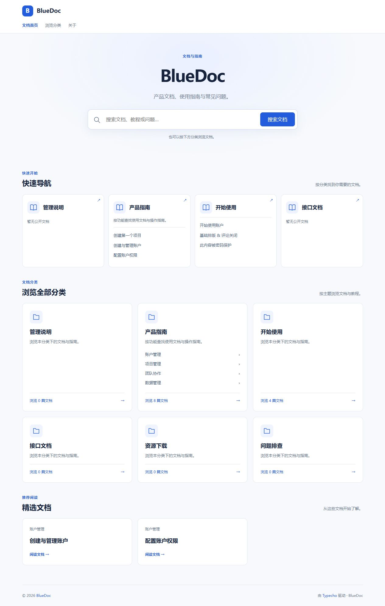

# BlueDoc

通用的 Typecho 文档中心主题，适用于产品帮助中心、教程站和知识库。

当前版本 **V0.3.2**，兼容 **Typecho 1.3.0 / PHP 8.2**，无需插件、外部框架或构建步骤。

首页由搜索、快速导航、全部分类和精选文档组成。入口自动读取后台原生分类的名称、简介、顺序和公开文章，不预设设备、行业或分类名称。支持无限层级分类树、多级面包屑、三栏阅读、H2/H3 目录和移动抽屉。

## 安装

将 `theme/` 内全部内容复制到 Typecho 的 `usr/themes/BlueDoc/`，在后台启用 **BlueDoc 0.3.2**。不要直接安装项目根目录。

- [安装、分类与升级说明](theme/README.md)
- [架构设计](docs/architecture.md)
- [V0.3.2 测试记录](docs/v0.3.2-validation.md)
- [更新记录](changelog.md)

在后台建立自己的分类即可使用。默认快速导航显示前四个一级分类，全部分类显示所有一级分类及直接子分类。也可在“设置外观”选择一个父分类，让快速导航展示它的前四个子分类。每张快速卡片显示该分支最新三篇公开文档。

## 开发验证

```sh
php tests/navigation.php
node --check theme/assets/js/main.js
node tests/typecho-smoke.mjs
```




后续计划：下载组件、深色模式和检索增强。
